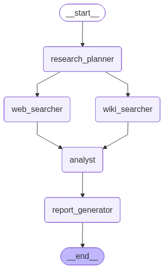

# Multi-Agent Research Backend

An AI-powered multi-agent research system built with **LangGraph**, **LangChain**, and **FastAPI**. Multiple AI agents collaborate to research a topic — planning queries, searching the web and Wikipedia, analyzing findings, and generating a final report.

## Architecture

The system uses a **LangGraph** state graph with 5 agent nodes:

```
START → research_planner → web_searcher ─┐
                         → wiki_searcher ─┤
                                          → analyst → report_generator → END
```

### Workflow Graph



| Node | Description |
|------|-------------|
| `research_planner` | Plans web and wiki search queries for the topic |
| `web_searcher` | Searches the web via Tavily and summarizes results |
| `wiki_searcher` | Searches Wikipedia and summarizes results |
| `analyst` | Analyzes and compares findings from all sources |
| `report_generator` | Generates a structured final report |

## Folder Structure

```
backend/
├── .env                # Environment variables (API keys)
├── .gitignore          # Git ignore rules
├── agents.py           # Agent node functions (planner, searcher, analyst, reporter)
├── app.py              # FastAPI application with /research endpoint
├── config.py           # LLM and environment configuration
├── graph.py            # LangGraph state graph construction
├── main.py             # Entry point (CLI and API modes)
├── requirements.txt    # Python dependencies
├── state.py            # ResearchState TypedDict definition
└── workflow.ipynb      # Jupyter notebook for interactive development
```

## Setup

### Prerequisites

- Python >= 3.12

### Installation

```bash
pip install -r requirements.txt
```

### Environment Variables

Create a `.env` file in the `backend/` directory:

```env
GROQ_API_KEY=your_groq_api_key
TAVILY_API_KEY=your_tavily_api_key
LANGSMITH_API_KEY=your_langsmith_api_key
```

## Usage

### CLI Mode

```bash
python main.py
```

### API Mode (FastAPI)

```bash
python main.py api
```

The API server starts at `http://127.0.0.1:8000`.

### API Endpoint

**POST** `/research`

Request:
```json
{
  "topic": "EV market comparison between India and USA"
}
```

Response:
```json
{
  "topic": "EV market comparison between India and USA",
  "research_plan": "...",
  "web_search": "...",
  "wiki_search": "...",
  "analysis": "...",
  "final_report": "..."
}
```

## Tech Stack

- **LLM**: Groq (Llama 3.1 8B Instant)
- **Orchestration**: LangGraph
- **Search**: Tavily (web), Wikipedia
- **API**: FastAPI + Uvicorn
- **Tracing**: LangSmith
